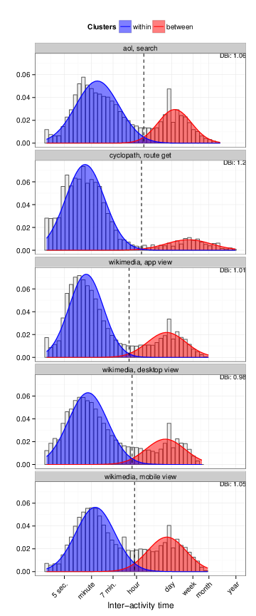

#Session reconstruction with reconstructr
<!--
  %\VignetteIndexEntry{Session Reconstruction}
  %\VignetteEngine{knitr::rmarkdown}
  %\usepackage[utf8]{inputenc}
-->

Within web analytics, session reconstruction is an essential prerequisite of a host of useful and commonly-requested
metrics, including time-on-site, time-on-page, and bounce rate. What approach to session reconstruction works best
is hotly debated, despite two decades of research in the field. This vignette described some of the most
commonly-used strategies, the advantages and disadvantages of each, and after arguing for *heuristic reconstruction*
as the most common and scientifically supported approach, demonstrates the proper use of <code>reconstructr</code>
to reconstruct sessions using this methodology.

## Approaches to session reconstruction
Sessions have been used as behavioral measures of human-computer interaction for almost two decades, and for this reason, strategies for session identification have been extensively studied. Broadly-speaking, there are two approaches:
**navigation-oriented heuristics** and **time-oriented heuristics**.

**Time-oriented heuristics** refer to the assignment of an inactivity threshold between logged events to serve as a session delimiter.  The assumption implied is that if there is a break between a user's actions that is sufficiently long, it's likely that the user is no longer *active*, the session is assumed to have ended, and a new session is created when the next action is performed. This is the most commonly-used approach to identify sessions, with 30 minutes serving as the most commonly used threshold.^[this applies both to [industry implementations](https://support.google.com/analytics/answer/2731565?hl=en) and [academic work on session reconstruction](http://mmc.tudelft.nl/sites/default/files/wsdm2014eickhoff.pdf)]

This approach is limited by the accuracy of the threshold; various studies have found, that 30 minutes
is not a useful threshold,^[see [Jones & Klinkner *Beyond the Session Timeout: Automatic Hierarchical
Segmentation of Search Topics in Query Logs*](http://www.cs.cmu.edu/~rosie/papers/jonesKlinknerCIKM2008.pdf)] or even called into question the idea that *any* time-based approach is worthwhile.^[see [Mehrzadi & Feitelson *On Extracting Session Data from Activity Logs*](http://leibniz.cs.huji.ac.il/tr/1294.pdf)]

Navigation-oriented heuristics involve inferring browsing patterns based on the HTTP referers and URLs associated with each request by a user. When a user begins navigating (without a referer), they have started a session; when a trail can no longer be traced to a previous request based on the referers and URLs of subsequent requests, the session has ended.  This approach has poor performance on sites with framesets due to its implicit assumptions about the architecture of
websites,^[see [Berendt et al. *The Impact of Site Structure and User Environment on Session Reconstruction in Web Usage Analysis*](http://warhol.wiwi.hu-berlin.de/~berendt/Papers/webkdd02_bookversion.pdf)] and is likely to be of increasingly limited use as more of the world switches to using the HTTPS protocol - which strips referers.

## The heuristic approach in detail
So, we have two approaches. One has questions raised about its basic accuracy, while the other is difficult to generalise and of continually decreasing utility as technology changes.

## Session reconstruction with reconstructr

## Calculating metrics from sessionised event data

